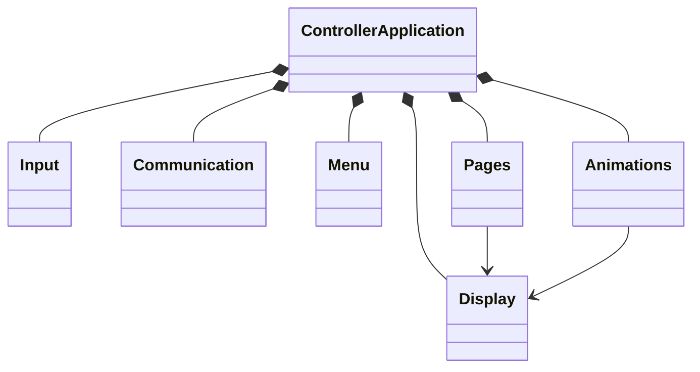

# Phase 1 — Arduino Nano Embedded Firmware

## 1. Folder structure

```text
AegisCareAI_Embedded/
├── include/
│   ├── Animations.h
│   ├── Communication.h
│   ├── Config.h
│   ├── Display.h
│   ├── Input.h
│   ├── Menu.h
│   ├── Pages.h
│   └── Utilities.h
├── src/
│   ├── Animations.cpp
│   ├── Communication.cpp
│   ├── Display.cpp
│   ├── Input.cpp
│   ├── Menu.cpp
│   ├── Pages.cpp
│   ├── Utilities.cpp
│   └── main.cpp
├── platformio.ini
└── README.md
```

## 2. Architecture

`ControllerApplication` is the composition root. It polls `Communication` and `Input`, changes `Menu`/`Pages` state, and asks `Display` to render only when state changes. The desktop remains authoritative. Emergency and start inputs bypass menu state and are sent immediately. Hardware constants live only in `Config.h`.

The startup sequence is logo → loading → OLED check → joystick check → button check → serial check → device ready → main menu. Runtime code avoids blocking delays.

## 3. Class diagram



## 4–5. Source and header responsibilities

| Module | Responsibility |
|---|---|
| `Config` | Pins, timing, display dimensions, serial limits |
| `Display` | SSD1306 initialization and all drawing operations |
| `Input` | Joystick sampling, switch debouncing, input priority |
| `Communication` | Bounded serial framing, JSON command/event protocol, heartbeat |
| `Menu` | Seven-item wrapped menu selection |
| `Pages` | Page state and operator-facing page content |
| `Animations` | Boot logo, progress, checks, ready sequence |
| `Utilities` | Rollover-safe timing and event-name mapping |
| `main` | Dependency composition and event coordination |

## 6. Wiring diagram

See [`Hardware/Wiring/Connections.md`](../Hardware/Wiring/Connections.md). The OLED uses I2C on A4/A5; joystick uses A0/A1/D2; Start uses D3; Emergency uses D4. All switches close to ground.

## 7. Communication protocol

Transport: USB serial, 115200 baud, 8-N-1. Each packet is one compact JSON object followed by `\n`. Maximum received packet size is 95 bytes.

Desktop to Nano examples:

```json
{"command":"START_SCAN"}
{"command":"STOP_SCAN"}
{"command":"PATIENT_SELECTED"}
{"command":"DIGITAL_TWIN"}
{"command":"SETTINGS"}
{"command":"WORKFLOW"}
```

Nano to desktop examples:

```json
{"status":"DEVICE_READY","device":"ARDUINO_NANO"}
{"event":"START_SCAN"}
{"event":"EMERGENCY"}
{"event":"UP"}
{"status":"HEARTBEAT","healthy":true}
```

Unknown commands are ignored safely. Oversized frames reset the receive buffer and return `INVALID_MESSAGE`.

## 8. Testing procedure

1. Run `pio run` and confirm SRAM/flash utilization remains within Nano limits.
2. Wire the hardware with power disconnected, then verify continuity and polarity.
3. Power on and confirm every boot stage and the main menu appear.
4. Move the joystick in all directions and confirm one event per detent/repeat interval.
5. Hold/release each switch and confirm debounce prevents duplicate events.
6. Press Start from every page and confirm `START_SCAN` is emitted immediately.
7. Press Emergency from every page and confirm `EMERGENCY` plus D13 indication.
8. Send each desktop JSON command through the serial monitor and verify the page/status response.
9. Leave the unit idle for 10 seconds and confirm two heartbeat packets.
10. Disconnect/reconnect USB and confirm the boot/ready sequence recovers.

Target compilation verified on the `nanoatmega328` environment: 19,484 bytes flash (63.4%) and 780 bytes SRAM (38.1%). Hardware-dependent upload and button/OLED checks remain to be performed with the physical Nano connected.

## 9. Build instructions

Install PlatformIO, connect the Nano, then run:

```sh
cd AegisCareAI_Embedded
PLATFORMIO_CORE_DIR="$PWD/.platformio" .venv/bin/pio run
PLATFORMIO_CORE_DIR="$PWD/.platformio" .venv/bin/pio run --target upload
PLATFORMIO_CORE_DIR="$PWD/.platformio" .venv/bin/pio device monitor --baud 115200
```

If using a classic Nano bootloader, add `board_build.mcu = atmega328p` and the appropriate upload speed for that board clone.

## 10. Suggested Git commit message

```text
feat(embedded): complete modular Arduino Nano controller firmware
```
